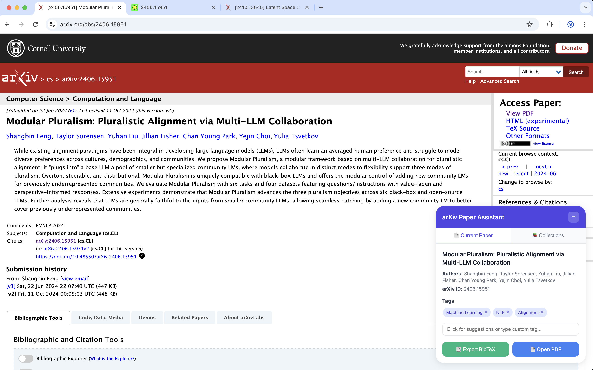
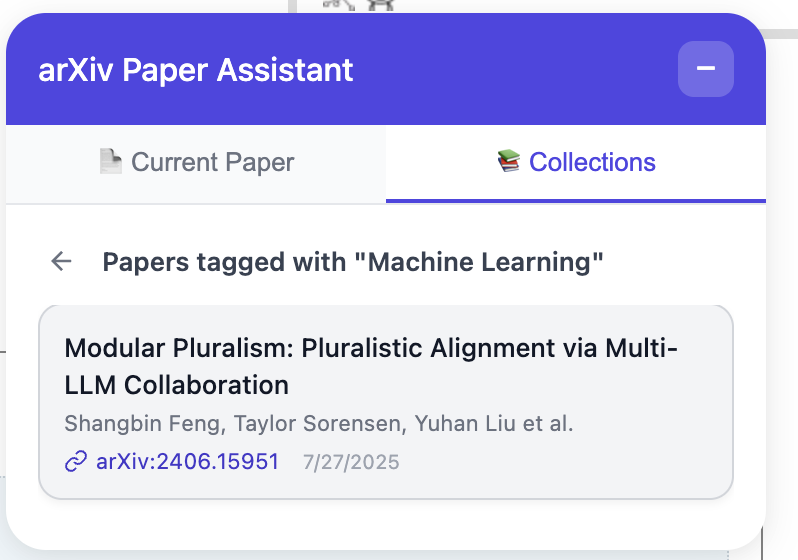
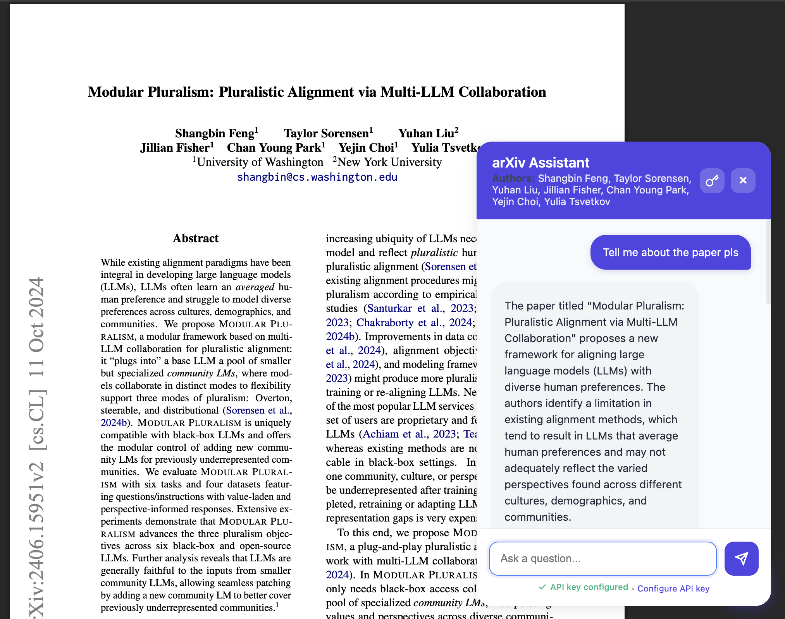

# arXiv Paper Assistant

An AI-powered Chrome extension for reading and organizing arXiv papers, built with WXT, React, and TypeScript.

## Overview

arXiv Paper Assistant enhances your arXiv paper reading experience by providing intelligent features to help you understand, organize, and interact with academic papers directly in your browser.

## Features

### AI-Powered Paper Analysis

Get instant AI-powered summaries and insights about arXiv papers directly in your browser. The extension adds a convenient sidebar to arXiv paper pages.

### Paper Collections & Organization

Organize your research with collections. Tag papers, create custom collections, and easily navigate through your saved papers.

### Interactive PDF Chat Assistant

Chat with an AI assistant while reading PDFs. Ask questions about the paper, get explanations of complex concepts, and configure your OpenAI API key for personalized interactions.

### Key Features:
- AI-powered paper analysis and summarization
- PDF text extraction and processing
- Interactive paper annotations
- Paper organization and storage
- Markdown rendering for formatted content
- Real-time paper content analysis

## Project Structure

```
wxt-dev-wxt/
├── entrypoints/
│   ├── background.ts      # Background service worker
│   ├── content.ts         # Content script for arXiv pages
│   └── popup/            # Extension popup UI
│       ├── App.tsx       # Main React component
│       ├── main.tsx      # React entry point
│       └── style.css     # Popup styles
├── public/
│   └── icon/             # Extension icons
├── wxt.config.ts         # WXT configuration
├── package.json          # Project dependencies
└── tsconfig.json         # TypeScript configuration
```

## Usage

1. Load the extension in Chrome:
   - Navigate to `chrome://extensions/`
   - Enable "Developer mode"
   - Click "Load unpacked"
   - Select the `.output/chrome-mv3-dev` directory

2. Navigate to any arXiv paper (e.g., https://arxiv.org/abs/xxxx.xxxxx)

3. The extension will automatically activate on arXiv pages, providing AI-powered features through the content script

4. Click the extension icon in the toolbar to access the popup interface

## Technologies

- **WXT**: Modern web extension framework
- **React**: UI library for building the popup interface
- **TypeScript**: Type-safe JavaScript
- **Vite**: Fast build tool and dev server
- **OpenAI API**: AI-powered paper analysis
- **PDF.js**: PDF text extraction
- **React Markdown**: Markdown rendering
- **Lucide React**: Icon library
